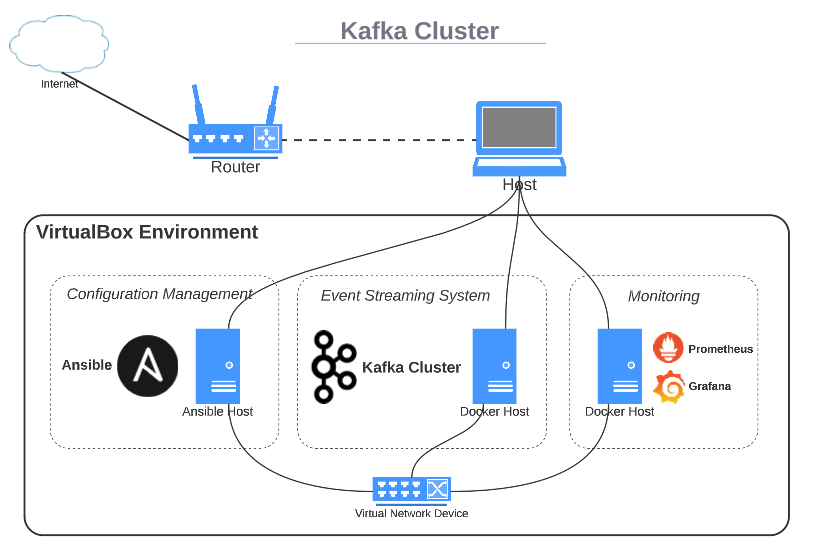

# Kafka Cluster on Docker
This is an automated solution for Kafka Single-Node Cluster (docker container) + Prometheus monitoring created through Vagrant and Ansible. Follow the steps below:
 - clone the repository; 
 - open the directory in terminal;
 - execute the command `vagrant up`;
 - wait until the environment is ready.

#### Requirements:

 - Regular computar (Laptop or PC) with RAM 16+ GB, Disk: 80+ GB, and CPU: Intel/AMD x64 with virtualization support;
 - VirtualBox 6.1+:  https://www.virtualbox.org/wiki/Downloads;
 - Vagrant 2.1+:  https://developer.hashicorp.com/vagrant/downloads;

## Cluster Details
The architecture of the cluster looks like:

You can find detailed information about the boxes that I have used here - https://app.vagrantup.com/merev.

### Environment Information
The operating system installed on the hosts is Debian 11. Each VM has 2 GB RAM, 2 CPUs, and 60 GB disk space. The hardware parameters can be adjusted before provisioning in the `config.vm.provider` block of the Vagrantfile. The firewall is disabled. Every node has 2 network interfaces:
 - 1 NIC in NAT Mode - connected to the host machine;
 - 1 NIC in Host-Only Mode - connected to a separate virtual network for isolated communication between the VMs. (Cluster Network)

### Kafka Cluster Information
Kafka Single-Node Cluster is started on a docker host. There are two containers:
 - Zookeeper Container
 - Broker Container
The configuration of the containers can be found here -   

### Monitoring and Configuration Management Information

The Docker and Ansible hosts are part of the same network and have the same parameters as the other VMs. Ansible is installed on the Ansible host and Prometheus Server and Grafana are started in containers. They are configured to manage and monitor the entire environment.

### Initial Configuration
The initial configuration of the cluster contains the following actions:
 - Kafka Cluster Initialization;
 - Ansible Host Configuration; 
 - Prometheus and Grafana Installation.
